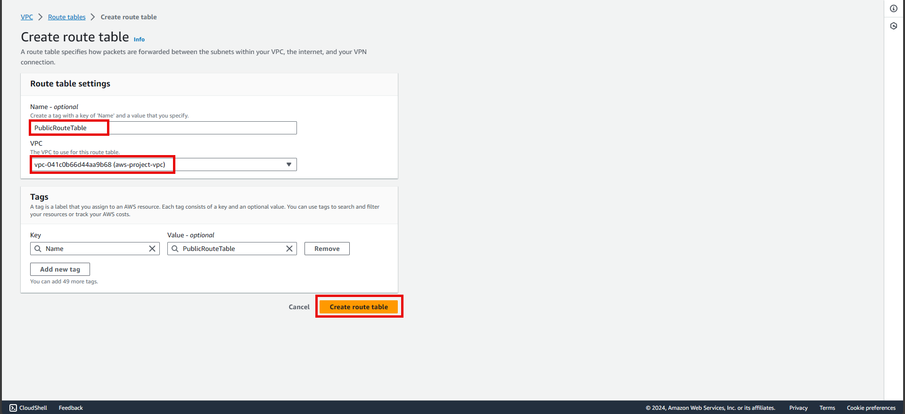
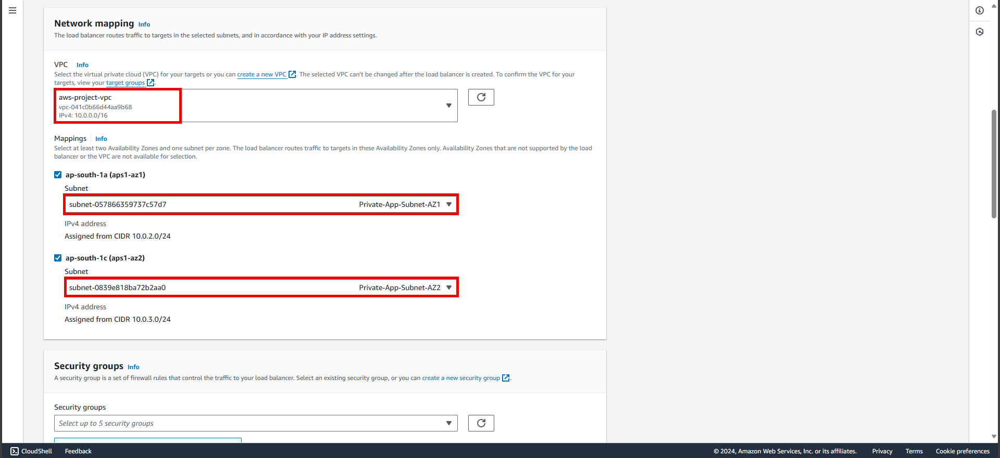
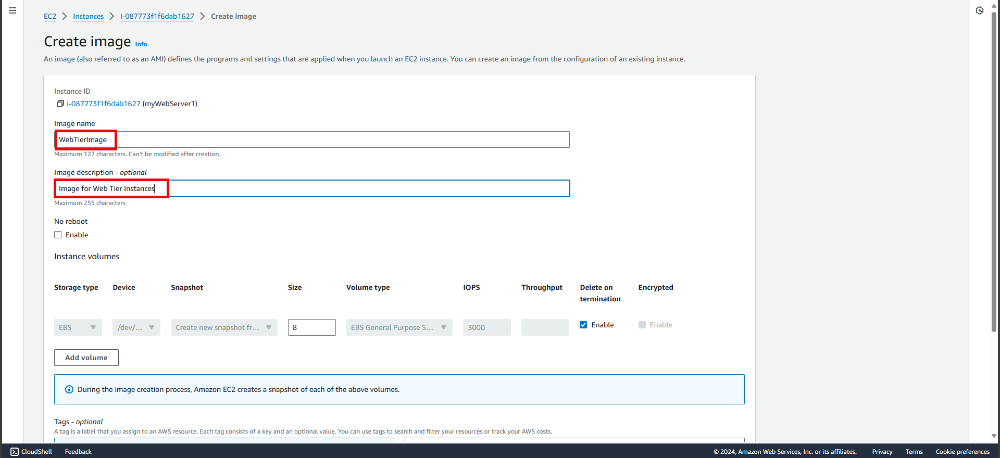

# AWS Three Tier Web Architecture

In this project, we utilize a public-facing Application Load Balancer, directing client traffic to our web-tier EC2 instances within autoscaling groups. The web tier, powered by Nginx web servers, serves a React.js website while redirecting API calls to the internal-facing load balancer in the application tier. Behind the scenes, the application tier, built with Node.js, manipulates data stored in an Aurora MySQL multi-AZ database. As a result it communicates between layers, ensuring uninterrupted operations. Load balancing, health checks, and autoscaling groups work harmoniously at every level, maintaining high availability.

<!-- [Reference](https://catalog.us-east-1.prod.workshops.aws/workshops/85cd2bb2-7f79-4e96-bdee-8078e469752a/en-US) -->

## Application architecture


## Part 1: Setup

For this project, we will be referencing and downloading the code from Github and upload it to S3 so our instances can access it. We will also create an AWS Identity and Access Management EC2 role so we can use AWS Systems Manager Session Manager to connect to our instances securely and without needing to create SSH key pairs.

### Step 1: S3 Bucket Creation

1. Navigate to the **S3 service console** and **create a new S3 bucket**.
2. Give it a **globally unique name**, and then leave all as defaults. Make sure to **select the region** as your preference, generally nearer is preffered. This bucket is where we will upload our code later.


### Step 2: IAM EC2 Instance Role Creation

1. Navigate to the **IAM console** and **create an EC2 role**.
   


2. Select **EC2 as the trusted entity**.


3. When adding permissions, include the following AWS managed policies. These policies will allow our instances to download our code from S3 and use Systems Manager Session Manager to securely connect to our instances without SSH keys through the AWS console.
   
   *** AmazonSSMManagedInstanceCore
   * AmazonS3ReadOnlyAccess**


4. Give this role a **name**, and then click **Create Role**.


## Part 2: Networking and Security

In this part we will be building out the VPC networking components as well as security groups that will add a layer of protection around our EC2 instances, Aurora databases, and Elastic Load Balancers.

Creating an isolated network with the following components:
* VPC
* Subnets
* Route Tables
* Internet Gateway
* NAT gateway
* Security Groups

### Step 1: VPC and Subnets

1. VPC Creation
   
   * Navigate to the **VPC console** and navigate to **Your VPCs** on the left hand side.

    

   * Make sure **VPC only** is selected, and fill out the VPC Settings with a **Name tag** and a **CIDR range** of your choice.

    

    *NOTE: Make sure to pay attention to the region you’re deploying all your resources in. You’ll want to stay consistent throughout the entire project.*

    *NOTE: Choose a CIDR range that will allow you to create at least 6 subnets.*

2. Subnet Creation
   
   * Next, create subnets by navigating to **Subnets** on the left side of the dashboard and clicking **Create subnet**.
    
    

   * We will need **six subnets across two availability zones**. That means that three subnets will be in one availability zone, and three subnets will be in another zone. Each subnet in one availability zone will correspond to one layer of our three tier architecture. Create each of the 6 subnets by specifying the VPC we created in previous step and then choose a name, availability zone, and appropriate CIDR range for each of the subnets.

    *NOTE: It may be helpful to have a naming convention that will help you remember what each subnet is for. For example in one AZ you might have the following: Public-Web-Subnet-AZ1, Private-App-Subnet-AZ1, Private-DB-Subnet-AZ1.*

    *NOTE: Remember, your CIDR range for the subnets will be subsets of your VPC CIDR range.*

    

    * Your final subnet setup should be similar to this. Verify that you have 3 subnets across 2 different availability zones.

    

### Step 2: Internet Connectivity

1. Internet Gateway
   
   * In order to give the public subnets in our VPC internet access we will have to create and attach an Internet Gateway. On the left hand side of the VPC dashboard, select **Internet Gateway**.

    

   * Create an internet gateway by giving it a name and clicking **Create internet gateway**.

    

   * After creating the internet gateway, attach it to the VPC that created in the **VPC and Subnet Creation** step. Do this either with the creation success message or the **Actions** drop down.

    

   * Then, select the correct VPC and click **Attach internet gateway**.

    

2. NAT Gateway

    * In order for our instances in the app layer private subnet to be able to access the internet they will need to go through a NAT Gateway. For high availability, we’ll deploy one NAT gateway in each of our public subnets. Navigate to **NAT Gateways** on the left side of the dashboard and click **Create NAT Gateway**.

    

    * Fill in the **Name**, choose one of the **public subnets** you created in previous part, and then allocate an Elastic IP. Click **Create NAT gateway**.

    

    * Repeat step 1 and 2 for the other subnet.

### Step 3: Routing Configuration

1. Navigate to **Route Tables** on the left side of the VPC dashboard and click **Create route table** First, let’s create one route table for the ***web layer public subnets*** and name it accordingly.




2. After creating the route table, it will be automatically taken to the details page. Scroll down and click on the **Routes tab** and **Edit routes**.


3. Add a route that directs traffic from the VPC to the internet gateway. In other words, for all traffic destined for IPs outside the VPC CIDR range, add an entry that directs it to the internet gateway as a target. Save the changes.


4. Edit the Explicit Subnet Associations of the route table by navigating to the route table details again. Select **Subnet Associations** and click **Edit subnet associations**.


Select the two web layer public subnets that created eariler and click **Save associations**.


5. Now create 2 more route tables, one for each app layer private subnet in each availability zone. These route tables will route app layer traffic destined for outside the VPC to the NAT gateway in the respective availability zone, so add the appropriate routes for that.


Once the route tables are created and routes added, add the appropriate subnet associations for each of the app layer private subnets.


### Step 4: Security Groups

1. Security groups will tighten the rules around which traffic will be allowed to our Elastic Load Balancers and EC2 instances. Navigate to **Security Groups** on the left side of the VPC dashboard, under **Security**.


2. The first security group we’ll create is for the public, **internet facing** load balancer. After typing a name and description, add an inbound rule to **allow HTTP** type traffic for our **IP**.


3. The second security group we’ll create is for the public instances in the web tier. After typing a name and description, add an inbound rule that allows **HTTP** type traffic from the internet facing load balancer security group that created in the previous step. This will allow traffic from our public facing load balancer to hit our instances. Then, add an additional rule that will allow HTTP type traffic for our IP. This will allow us to access our instance when we test.


4. The third security group will be for our internal load balancer. Create this new security group and add an inbound rule that allows **HTTP** type traffic from our public instance security group. This will allow traffic from our web tier instances to hit our internal load balancer.


5. The fourth security group we’ll configure is for our private instances. After typing a name and description, add an inbound rule that will allow **TCP** type traffic on **port 4000** from the **internal load balancer security group** that created in the previous step. This is the port our app tier application is running on and allows our internal load balancer to forward traffic on this port to our private instances. We should also add another route for **port 4000** that allows our **IP** for testing.


6. The fifth security group we’ll configure protects our private database instances. For this security group, add an inbound rule that will allow traffic from the private instance security group to the MYSQL/Aurora port (3306).


## Part 3: Database Deployment

In this part we will deploy the database layer of the three tier architecture.

* Deploy Database Layer
  * Subnet Groups
  * Multi-AZ Database

### Step 1: Subnet Groups

1. Navigate to the **RDS dashboard** in the AWS console and click on **Subnet groups** on the left hand side. Click **Create DB subnet group**.


2. Give your subnet group a **name**, **description**, and choose the **VPC** we created.


3. When adding subnets, make sure to add the subnets we created in each availability zone specificaly for our database layer. We may have to navigate back to the VPC dashboard and check to make sure we're selecting the correct subnet IDs.


### Step 2: Database Deployment

1. Navigate to **Databases** on the left hand side of the RDS dashboard and click **Create database**.


2. We'll now go through several configuration steps. Start with a **Standard create** for this **MySQL-Compatible Amazon Aurora** database. Leave the rest of the defaults in the **Engine options** as default.


Under the **Templates** section choose **Dev/Test** since this isn't being used for production at the moment. Under **Settings** set a username and password of your choice and note them down since we'll be using password authentication to access our database.


Next, under **Availability and durability** change the option to create an Aurora Replica or reader node in a different availability zone. Under **Connectivity**, set the VPC, choose the subnet group we created earlier, and select no for public access.

Set the security group we created for the database layer, make sure **password authentication** is selected as our authentication choice, and create the database.


3. When our database is provisioned, we should see a reader and writer instance in the database subnets of each availability zone. Note down the writer endpoint for our database for later use.

## Part 4: App Tier Instance Deployment

In this part we will create an EC2 instance for our app layer and make all necessary software configurations so that the app can run. The app layer consists of a Node.js application that will run on port 4000. We will also configure our database with some data and tables.

Objectives:
* Create App Tier Instance
* Configure Software Stack
* Configure Database Schema
* Test DB connectivity

### Step 1: App Instance Deployment

1. Navigate to the **EC2 service dashboard** and click **Launch Instance**.
   


2. Give it a **name** to our instance and select the first **Amazon Linux 2023 AMI**.
   


3. We'll be using the free tier eligible **t2.micro instance** type. For key pair, since we are using Systems Manager Session Manager to connect to the instance, **proceed without a keypair**.
   


4. When configuring network settings, make sure to select to correct **VPC, subnet, security group (which we created for our private app layer instances), IAM role and disable auto assign public IP** we created. Note that this is the app layer, so use one of the private subnets we created for this layer.
   


5. We'll be keeping the defaults for storage.
   
6. Review the details and click **Launch instance**.
   


### Step 2: Connect to Instance

1. Navigate to list of running EC2 Instances by clicking on **Instances** on the left hand side of the EC2 dashboard. When the instance state is running, connect to our instance by clicking the checkmark box to the left of the instance, and click the **connect** button on the top right corner of the dashboard.Select the **Session Manager** tab, and click **connect**. This will open a new browser tab.

*NOTE: If you get a message saying that you cannot connect via session manager, then check that your instances can route to your NAT gateways and verify that you gave the necessary permissions on the IAM role for the EC2 instance.*


2. When we first connect to your instance like this, we will be logged in as ssm-user which is the default user. Switch to **ec2-user** by executing the following command in the browser terminal:

```bash
sudo -su ec2-user
```

3. Let’s take this moment to make sure that we are able to reach the internet via our NAT gateways. If your network is configured correctly up till this point, we should be able to ping the google DNS servers:

```bash
ping 8.8.8.8
```

We should see a transmission of packets. Stop it by pressing ctrl+c.

NOTE: If we can’t reach the internet then we need to double check your route tables and subnet associations to verify if traffic is being routed to your NAT gateway!

### Step 3: Configure Database

1. Start by downloading the MySQL CLI:

```bash
sudo yum install -y https://dev.mysql.com/get/mysql57-community-release-el7-11.noarch.rpm
sudo yum install -y mysql-community-client
```

2. Initiate DB connection with Aurora RDS writer endpoint. In the following command, replace the RDS writer endpoint and the username, and then execute it in the browser terminal:

```bash
mysql -h CHANGE-TO-YOUR-RDS-ENDPOINT -u CHANGE-TO-USER-NAME -p
```

We will then be prompted to type in your password. Once we input the password and hit enter, we should now be connected to your database.

*NOTE: If you cannot reach your database, check your credentials and security groups.*

3. Create a database called **webappdb** with the following command using the MySQL CLI:

```SQL
CREATE DATABASE webappdb;
```

We can verify that it was created correctly with the following command:

```SQL
SHOW DATABASES;
```

4. Create a data table by first navigating to the database we just created:

```SQL
USE webappdb;
```

Then, create the following **transactions** table by executing this create table command:

```SQL
CREATE TABLE IF NOT EXISTS transactions(id INT NOT NULL
AUTO_INCREMENT, amount DECIMAL(10,2), description
VARCHAR(100), PRIMARY KEY(id));
```

Verify the table was created:

```SQL
SHOW TABLES;
```

5. Insert data into table for use/testing later:

```SQL
INSERT INTO transactions (amount,description) VALUES ('400','groceries');
```

Verify that our data was added by executing the following command:

```SQL
SELECT * FROM transactions;
```

6. When finished, just type **exit** and hit enter to exit the MySQL client.

### Step 4: Configure App Instance

1. The first thing we will do is update our database credentials for the app tier. To do this, open the **application-code/app-tier/DbConfig.js** file from the github repo in local text editor on computer. We’ll see empty strings for the hostname, user, password and database. Fill this in with the credentials configured for our database, the **writer** endpoint of our database as the hostname, and **webappdb** for the database. Save the file.
   


2. Upload the **app-tier** folder to the S3 bucket that created earlier.

3. Go back to the SSM session. Now we need to install all of the necessary components to run our backend application. Start by installing NVM (node version manager).

```bash
curl -o- https://raw.githubusercontent.com/nvm-sh/nvm/v0.38.0/install.sh | bash
source ~/.bashrc
```

4. Next, install a compatible version of Node.js and make sure it's being used

```bash
nvm install 16
nvm use 16
```

5. PM2 is a daemon process manager that will keep our node.js app running when we exit the instance or if it is rebooted. Install that as well.

```bash
npm install -g pm2
``` 

6. Now we need to download our code from our s3 buckets onto our instance. In the command below, replace BUCKET_NAME with the name of the bucket we uploaded the **app-tier** folder to:

```bash
cd ~/
aws s3 cp s3://BUCKET_NAME/app-tier/ app-tier --recursive
```

7. Navigate to the app directory, install dependencies, and start the app with pm2.

```bash
cd ~/app-tier
npm install
pm2 start index.js
```

To make sure the app is running correctly run the following:

```bash
pm2 list
```

If the status is online, the app is running. If it is errored, then we need to do some troubleshooting. To look at the latest errors, use this command:

```bash
pm2 logs
```

*NOTE: If you’re having issues, check your configuration file for any typos, and double check that you have followed all installation commands till now.*

8. Right now, pm2 is just making sure our app stays running when we leave the SSM session. However, if the server is interrupted for some reason, we still want the app to start and keep running. This is also important for the AMI we will create:

```bash
pm2 startup
```

After running this we will see a message similar to this.

```bash
[PM2] To setup the Startup Script, copy/paste the following command: sudo env PATH=$PATH:/home/ec2-user/.nvm/versions/node/v16.0.0/bin /home/ec2-user/.nvm/versions/node/v16.0.0/lib/node_modules/pm2/bin/pm2 startup systemd -u ec2-user —hp /home/ec2-user
```

**DO NOT run the above command**, rather we should copy and past the command in the output we see in our own terminal. After running it, save the current list of node processes with the following command:

```bash
pm2 save
```

### Step 5: Test App Tier

Now let's run a couple tests to see if our app is configured correctly and can retrieve data from the database.

To hit out health check endpoint, copy this command into your SSM terminal. This is our simple health check endpoint that tells us if the app is simply running.

```bash
curl http://localhost:4000/health
```

The response should looks like the following:

```bash
"This is the health check"
```

Next, test our database connection. We can do that by hitting the following endpoint locally:

```bash
curl http://localhost:4000/transaction
```

We should see a response containing the test data we added earlier:

```bash
{"result":[{"id":1,"amount":400,"description":"groceries"}]}
```

If we see both of these responses, then our networking, security, database and app configurations are correct and app layer is fully configured and ready to go.

## Part 5: Internal Load Balancing and Auto Scaling

In this part we will create an Amazon Machine Image (AMI) of the app tier instance we just created, and use that to set up autoscaling with a load balancer in order to make this tier highly available.

Objectives:
* Create an AMI of our App Tier
* Create a Launch Template
* Configure Autoscaling
* Deploy Internal Load Balancer

### Step 1: App Tier AMI

1. Navigate to **Instances** on the left hand side of the EC2 dashboard. Select the app tier instance we created and under **Actions** select **Image and templates**. Click **Create Image**.


2. Give the image a name and description and then click **Create image**.
   


### Step 2: Target Group

1. While the AMI is being created, we can go ahead and create our target group to use with the load balancer. On the EC2 dashboard navigate to **Target Groups** under **Load Balancing** on the left hand side. Click on **Create Target Group**.


2. The purpose of forming this target group is to use with our load balancer so it may balance traffic across our private app tier instances. Select Instances as the target type and give it a name.


Then, set the protocol to **HTTP** and the port to 4000. Remember that this is the port our Node.js app is running on. Select the VPC we've been using thus far, and then change the health check path to be **/health**. This is the health check endpoint of our app. Click **Next**.


3. We are **NOT** going to register any targets for now, so just skip that step and create the target group.
   
   

### Step 3: Internal Load Balancer

1. On the left hand side of the EC2 dashboard select **Load Balancers** under **Load Balancing** and click **Create Load Balancer**.


2. We'll be using an **Application Load Balancer** for our **HTTP** traffic so click the create button for that option.


3. After giving the load balancer a name, be sure to select **internal** since this one will not be public facing, but rather it will route traffic from our web tier to the app tier.


Select the correct network configuration for VPC and private subnets.



Select the security group we created for this internal ALB. Now, this ALB will be listening for HTTP traffic on port 80. It will be forwarding the traffic to our **target group** that we just created, so select it from the dropdown, and create the load balancer.


### Step 4: Launch Template

1. Before we configure Auto Scaling, we need to create a Launch template with the AMI we created earlier. On the left side of the EC2 dashboard navigate to **Launch Template** under **Instances** and click **Create Launch Template**.


2. Name the Launch Template, and then under **Application and OS Images** include the app tier AMI we created.


Under **Instance Type** select t2.micro. For **Key pair** and **Network Settings** don't include it in the template. We don't need a key pair to access our instances and we'll be setting the network information in the autoscaling group.


Set the correct security group for our app tier, and then under **Advanced details** use the same IAM instance profile we have been using for our EC2 instances.


### Step 5: Auto Scaling

1. We will now create the Auto Scaling Group for our app instances. On the left side of the EC2 dashboard navigate to **Auto Scaling Groups** under **Auto Scaling** and click **Create Auto Scaling group**.


2. Give the Auto Scaling group a name, and then select the Launch Template we just created and click next.


3. On the **Choose instance launch options** page set VPC, and the private instance subnets for the app tier and continue to step 3.


4. For this step, attach this Auto Scaling Group to the Load Balancer we just created by selecting the existing load balancer's target group from the dropdown. Then, click next.


5. For **Configure group size and scaling policies**, set desired, minimum and maximum capacity to **2**. Click skip to review and then **Create Auto Scaling Group**.


We should now have your internal load balancer and autoscaling group configured correctly. We should see the autoscaling group spinning up 2 new app tier instances.

## Part 6: Web Tier Instance Deployment

In this part we will deploy an EC2 instance for the web tier and make all necessary software configurations for the NGINX web server and React.js website.

Objectives:
* Update NGINX Configuration Files
* Create Web Tier Instance
* Configure Software Stack

### Step 1: Update Config File

Before we create and configure the web instances, open up the **application-code/nginx.conf** file from the repo we downloaded. Scroll down to **line 58** and replace [INTERNAL-LOADBALANCER-DNS] with our internal load balancer’s DNS entry. You can find this by navigating to your internal load balancer's details page.

Then, **upload this file and the application-code/web-tier** folder to the s3 bucket we created.

### Step 2: Web Instance Deployment

1. Follow the same instance creation instructions we used for the App Tier instance in **Part 4: App Tier Instance Deployment**, with the exception of the subnet. We will be provisioning this instance in one of our **public subnets**. Make sure to select the correct network components, security group, and IAM role. This time, auto-assign a public ip on the Configure Instance Details page. Remember to give the instance a name so we can identify it more easily. And proceed without a key pair for this instance.


### Step 3: Connect to Instance

Follow the same steps we used to connect to the app instance and change the user to ec2-user. Test connectivity here via ping as well since this instance should have internet connectivity:

```bash
sudo -su ec2-user 
ping 8.8.8.8
```

*Note: If you don't see a transfer of packets then you'll need to verify your route tables attached to the subnet that your instance is deployed in.*

### Step 4: Configure Web Instance

1. We now need to install all of the necessary components needed to run our front-end application. Again, start by installing NVM and node :

```bash
curl -o- https://raw.githubusercontent.com/nvm-sh/nvm/v0.38.0/install.sh | bash
source ~/.bashrc
nvm install 16
nvm use 16
```

2. Now we need to download our web tier code from our s3 bucket:

```bash
cd ~/
aws s3 cp s3://BUCKET_NAME/web-tier/ web-tier --recursive
```

Navigate to the web-layer folder and create the build folder for the react app so we can serve our code:

```bash
cd ~/web-tier
npm install 
npm run build
```

3. NGINX can be used for different use cases like load balancing, content caching etc, but we will be using it as a web server that we will configure to serve our application on port 80, as well as help direct our API calls to the internal load balancer.

```bash
sudo amazon-linux-extras install nginx1 -y
```

4. We will now have to configure NGINX. Navigate to the Nginx configuration file with the following commands and list the files in the directory:

```bash
cd /etc/nginx
ls
```

We should see an nginx.conf file. We’re going to delete this file and use the one we uploaded to s3. Replace the bucket name in the command below with the one we created.

```bash
sudo rm nginx.conf
sudo aws s3 cp s3://BUCKET_NAME/nginx.conf .
```

Then, restart Nginx with the following command:

```bash
sudo service nginx restart
```

To make sure Nginx has permission to access our files execute this command:

```bash
chmod -R 755 /home/ec2-user
```

And then to make sure the service starts on boot, run this command:

```bash
sudo chkconfig nginx on
```

## Part 7: External Load Balancer and Auto Scaling

In this part we will create an Amazon Machine Image (AMI) of the web tier instance we just created, and use that to set up autoscaling with an external facing load balancer in order to make this tier highly available.

Objectives:
* Create an AMI of our Web Tier
* Create a Launch Template
* Configure Auto Scaling
* Deploy External Load Balancer

### Step 1: Web Tier AMI

1. Navigate to **Instances** on the left hand side of the EC2 dashboard. Select the web tier instance we created and under **Actions** select **Image and templates**. Click **Create Image**.


2. Give the image a name and description and then click **Create image**.



### Step 2: Target Group

1. While the AMI is being created, we can go ahead and create our target group to use with the load balancer. On the EC2 dashboard navigate to **Target Groups** under **Load Balancing** on the left hand side. Click on **Create Target Group**.

2. The purpose of forming this target group is to use with our load blancer so it may balance traffic across our public web tier instances. Select Instances as the target type and give it a name.


Then, set the protocol to **HTTP** and the port to 80. Remember this is the port NGINX is listening on. Select the VPC we've been using thus far, and then change the health check path to be **/health**. Click **Next**.


3. We are **NOT** going to register any targets for now, so just skip that step and create the target group.

### Step 3: Internet Facing Load Balancer

1. On the left hand side of the EC2 dashboard select **Load Balancers** under **Load Balancing** and click **Create Load Balancer**.

2. We'll be using an **Application Load Balancer** for our **HTTP** traffic so click the create button for that option.

3. After giving the load balancer a name, be sure to select **internet facing** since this one will not be public facing, but rather it will route traffic from our web tier to the app tier.


Select the correct network configuration for VPC and **public** subnets.


Select the security group we created for this internal ALB. Now, this ALB will be listening for HTTP traffic on port 80. It will be forwarding the traffic to our target group that we just created, so select it from the dropdown, and create the load balancer.


### Step 4: Launch Template

1. Before we configure Auto Scaling, we need to create a Launch template with the AMI we created earlier. On the left side of the EC2 dashboard navigate to **Launch Template** under **Instances** and click **Create Launch Template**.

2. Name the Launch Template, and then under **Application and OS Images** include the app tier AMI you created.


Under **Instance Type** select t2.micro. For **Key pair** and **Network Settings** don't include it in the template. We don't need a key pair to access our instances and we'll be setting the network information in the autoscaling group.


Set the correct security group for our web tier, and then under **Advanced details** use the same IAM instance profile we have been using for our EC2 instances.


### Step 5: Auto Scaling

1. We will now create the Auto Scaling Group for our web instances. On the left side of the EC2 dashboard navigate to **Auto Scaling Groups** under **Auto Scaling** and click **Create Auto Scaling group**.

2. Give the Auto Scaling group a name, and then select the Launch Template we just created and click next.


3. On the **Choose instance launch options** page set VPC, and the public subnets for the web tier and continue to step 3.

4. For this step, attach this Auto Scaling Group to the Load Balancer we just created by selecting the existing web tier load balancer's target group from the dropdown. Then, click next.


5. For **Configure group size and scaling policies**, set desired, minimum and maximum capacity to **2**. Click skip to review and then Create Auto Scaling Group.


We should now have your external load balancer and autoscaling group configured correctly. We should see the autoscaling group spinning up 2 new web tier instances.

To test if our entire architecture is working, navigate to our external facing loadbalancer, and plug in the DNS name into browser.


